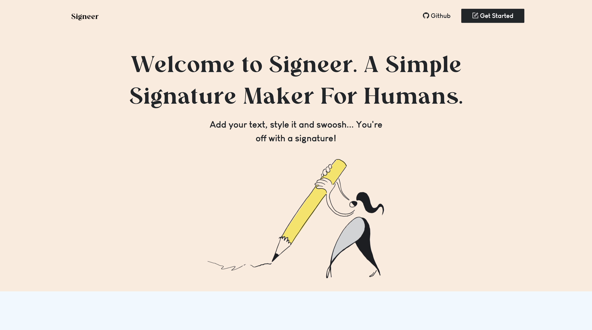
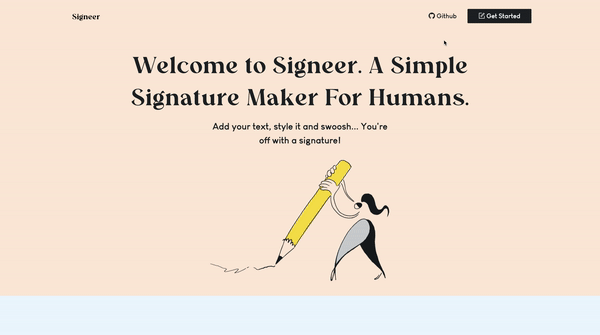

# Introduction
Hello there! This is Signeer. A simple text to image widget I wrote on Next.js with React, Sass, Ant.design UI Library, and Canvas. Have fun hacking! 🖊️
<br />
<br />


# How to use

 It's really easy and straightforward:
* Enter your name or signature text.
* Select a font.
* Pick a colour.
* Set your font size.
* Hit 'Create Signature' button.
* On the Top-Right corner (Top in mobile view) of the signature image, hit download.
<br/>
<br />



# Getting Started

First, run the development server:

```bash
npm run dev
# or
yarn dev
```

Open [http://localhost:3000](http://localhost:3000) with your browser to see the result.

You can start editing the page by modifying `pages/index.js`. The page auto-updates as you edit the file.
</div>


<div style="margin-bottom:2em">

# Learn More About Next.js Here

To learn more about Next.js, take a look at the following resources:

- [Learn Next.js](https://nextjs.org/learn) - an interactive Next.js tutorial.
- You can check out [the Next.js GitHub repository](https://github.com/vercel/next.js/) - your feedback and contributions are welcome!
</div>


<div style="margin-bottom:2em">

# Special Thanks To

[ Vercel ](https://vercel.com/) for sponsoring this project's hosting

[](https://vercel.com/import/git?s=https://github.com/shal0mdave/signeer-signature-maker&project-name=signeer-signature-maker&repo-name=signeer-signature-maker)

[ MDN ](https://developer.mozilla.org/en-US/docs/Web/API/Canvas_API/Tutorial/) for the docs on working with Canvas API

[](https://developer.mozilla.org/en-US/docs/Web/API/Canvas_API/Tutorial/)

</div>

<!-- # Learn More About Next.js Here -->